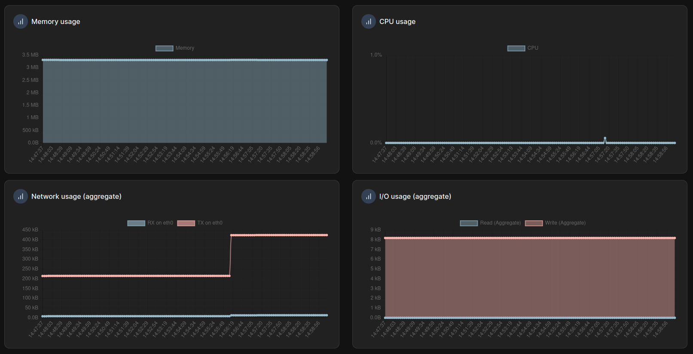

# Stark Bank Webhook & Payment Integration

[](https://github.com/JhonatanRian/webhook-payment/actions/workflows/deploy.yml)
[](https://codecov.io/gh/JhonatanRian/webhook-payment)
[](https://www.python.org/)
[](https://github.com/astral-sh/ruff)

Asynchronous FastAPI backend built with a **Modular Monolith** architecture for integrating with the **Stark Bank Sandbox API**. 

The service automates the lifecycle of issuing batches of 8 to 12 Pix invoices every 3 hours over a 24-hour cycle, handles incoming ECDSA-signed webhook credit notifications with strict idempotency, and automatically triggers payout transfers of the credited net amounts back to the institution's account.

---

## 📚 Documentation Index

Detailed documentation is available in Portuguese within the [`docs/`](docs/) directory:

- 🏛️ **[Architecture & Design (`docs/architecture.md`)](docs/architecture.md)** — Modular Monolith design, 4-layer separation, async database, and threadpool delegation.
- 📋 **[Business Rules & 24h Cycles (`docs/business-rules.md`)](docs/business-rules.md)** — Scheduler engine, `once` vs `recurring` modes, net amount math, and ECDSA signature verification.
- 📌 **[API Reference (`docs/api-reference.md`)](docs/api-reference.md)** — Endpoints, request/response contracts, query parameters, and status codes.
- 🚢 **[Deployment & Infrastructure (`docs/deployment.md`)](docs/deployment.md)** — 70 MB Alpine multi-stage Docker build, GHCR, Traefik v3 reverse proxy, and Portainer auto-deploy.
- 🧪 **[Testing Strategy (`docs/testing.md`)](docs/testing.md)** — Unit, integration, and adversarial concurrency tests with 100% code coverage.
- 🛠️ **[Tooling & Config (`docs/tooling.md`)](docs/tooling.md)** — Astral `uv`, Ruff linter/formatter, and pre-push Git hooks.

---

## 💡 Engineering Decision: Scheduler Modes (`once` vs `recurring`)

The challenge required generating invoices every 3 hours over a 24-hour period. Because this can be interpreted as either a fixed test evaluation or a continuous production schedule, both modes were implemented:

1. **`once` (Default for Sandbox Evaluation)**: Runs exactly **8 cycles** (8 cycles × 3 hours = 24 hours) and then stops automated generation. This completes the test challenge cleanly without continuously polluting the sandbox environment.
2. **`recurring` (Continuous Production)**: Runs indefinitely using a **24-hour rolling window** to enforce a maximum of 8 cycles per 24-hour period.

> The mode can be changed at runtime via `PUT /api/v1/scheduler/mode` or triggered on-demand via `POST /api/v1/scheduler/trigger`.

---

## 🔑 Prerequisites: ECDSA Key Pair

Authentication with Stark Bank requires an ECDSA key pair (`secp256k1`).

1. **Generate your keys** using Python:
   ```python
   import starkbank

   private_key, public_key = starkbank.key.create()
   print("Private Key:\n", private_key)
   print("Public Key:\n", public_key)
   ```

2. **Register the Public Key** in the [Stark Bank Sandbox Dashboard](https://sandbox.starkbank.com) under **Settings > Keys / Projects**.

3. **Configure the Private Key** in your `.env` file via `STARK_PRIVATE_KEY` (raw PEM string) or `STARK_PRIVATE_KEY_PATH` (file path).

---

## 🚀 Quickstart (Local Development)

This project uses [Astral `uv`](https://docs.astral.sh/uv/) for Python package management.

### 1. Install dependencies
```bash
uv sync --dev
```

### 2. Configure environment
```bash
cp .env.example .env
# Edit .env and fill in your STARK_PROJECT_ID and STARK_PRIVATE_KEY
```

### 3. Run database migrations
```bash
uv run alembic upgrade head
```

### 4. Start the server
```bash
uv run uvicorn app.main:app --reload --port 8000
```

- **Interactive Swagger Docs:** [http://localhost:8000/docs](http://localhost:8000/docs)
- **ReDoc:** [http://localhost:8000/redoc](http://localhost:8000/redoc)
- **Health Check:** [http://localhost:8000/health](http://localhost:8000/health)

---

## 🧪 Testing & Code Quality

```bash
# Run all tests with coverage report
uv run pytest -v --cov=app --cov-report=term-missing

# Run Ruff linter and formatter checks
uv run ruff check .
uv run ruff format --check .
```

---

## 🐳 Docker Deployment & Production Telemetry

The repository includes a production-ready, ultra-lightweight (~70 MB) Alpine Docker container running Uvicorn behind an Nginx Unix socket reverse proxy:

```bash
# Build and run with docker-compose
docker compose up -d --build
```

### 📊 Real Production Metrics (VPS)



- **Memory Footprint:** Only **~3.5 MB of RAM** under active operation.
- **CPU Usage:** Consistently **< 0.2% CPU** with negligible spikes during webhook handling.
- **Ultra-lightweight:** Alpine Linux runtime with zero compiler bloat.

---

## 📌 Main API Endpoints

| Method | Endpoint | Description |
| :--- | :--- | :--- |
| `POST` | `/api/v1/webhooks/starkbank` | Webhook receiver; validates ECDSA signature and initiates net payout |
| `POST` | `/api/v1/invoices/batch` | Manually generates an invoice batch (8–12 invoices) |
| `GET` | `/api/v1/invoices/batches` | Paginated list of issued invoice batches and items |
| `GET` | `/api/v1/invoices` | Paginated list of individual invoices with status filter |
| `GET` | `/api/v1/transfers` | Paginated list of payout transfers |
| `GET` | `/api/v1/scheduler/status` | Current scheduler status (completed cycles, mode, next run) |
| `POST` | `/api/v1/scheduler/trigger` | Triggers an immediate on-demand invoice cycle |
| `PUT` | `/api/v1/scheduler/mode` | Updates scheduler mode (`once` vs `recurring`) |
| `POST` | `/api/v1/scheduler/reset` | Resets cycle execution history in the database |
| `GET` | `/health` | Application health check endpoint |
