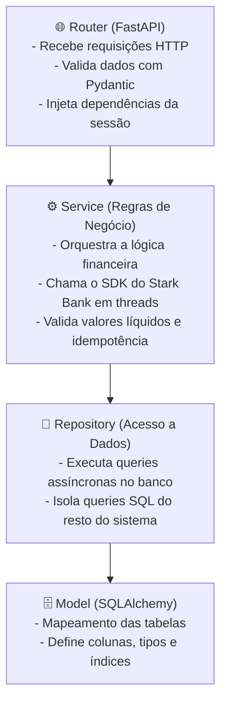
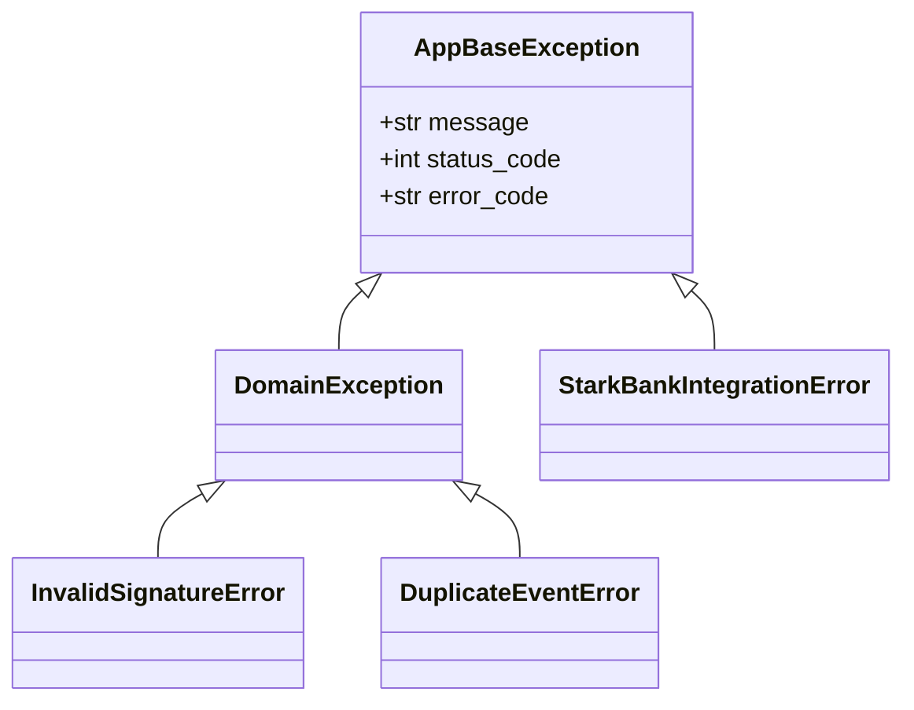

# 🏛️ Arquitetura & Design de Software

Nesta seção explicamos como estruturamos a aplicação, quais decisões de design tomamos e como lidamos com os desafios de concorrência e integração financeira.

---

## 🎯 Por que Monólito Modular?

Ao desenhar a aplicação, optamos pelo padrão **Monólito Modular** (Modular Monolith) em vez de dividir prematuramente o sistema em microsserviços ou jogar tudo em um único arquivo desestruturado.

### Principais Motivações:
1. **Domínios Bem Delimitados**: Cada módulo (`invoice`, `webhook`, `transfer`, `scheduler`) é autocontido, com seus próprios modelos, repositórios, serviços e rotas.
2. **Simplicidade Operacional**: Rodamos tudo em um único container de ~70 MB, sem a sobrecarga de latência de rede ou orquestração complexa de múltiplos serviços.
3. **Consistência Transacional**: Operações que envolvem atualização de faturas e registros de auditoria rodam na mesma sessão transacional do banco de dados assíncrono.
4. **Caminho Claro para Microsserviços**: Se no futuro o módulo de `webhook` ou `transfer` precisar de escalabilidade independente, a extração para um microsserviço é quase direta, pois os limites de contexto já estão desenhados.

---

## 🗺️ Organização das Pastas

O código em [`app/`](../app) está organizado da seguinte forma:

```text
app/
├── core/                  # Configurações globais, segurança, logs e middlewares
│   ├── config.py          # Settings tipadas com Pydantic v2 (.env)
│   ├── concurrency.py     # Decorator para rodar o SDK síncrono em threadpool
│   ├── logging.py         # Formatação de logs estruturados (JSON / Console)
│   ├── middleware.py      # Middleware para injeção de Request-ID em logs e headers
│   ├── starkbank.py       # Inicialização das chaves ECDSA do Stark Bank SDK
│   └── exceptions/        # Hierarquia tipada de exceções e handlers HTTP
├── infra/                 # Infraestrutura de banco de dados
│   └── db/
│       ├── base.py        # DeclarativeBase desacoplada
│       └── session.py     # Engine async SQLAlchemy e sessionmaker
├── shared/                # Contratos e utilitários compartilhados
│   ├── models.py          # Base model com UUID v4 e timestamps UTC
│   ├── pagination.py      # Estrutura padronizada de paginação (Page[T])
│   └── repository.py      # BaseRepository genérico com CRUD assíncrono
└── modules/               # Módulos de Domínio
    ├── invoice/           # Emissão e listagem de faturas Pix
    ├── webhook/           # Recepção e validação de assinaturas ECDSA
    ├── transfer/          # Disparo de transferências de liquidação
    └── scheduler/         # Agendador de ciclos periódicos e retomada pós-reinicialização
```

---

## 🧱 As 4 Camadas de Cada Módulo

Cada módulo de negócio segue estritamente a separação em 4 camadas de responsabilidade:



- **`router.py`**: Apenas recebe a requisição HTTP, aciona a injeção de dependência (`get_db`) e retorna o DTO de resposta.
- **`service.py`**: Onde mora a lógica de negócio (ex: cálculo de `amount - fee`, chamadas ao SDK externo, tratamento de duplicidade).
- **`repository.py`**: Métodos de banco específicos (ex: buscar faturas por `stark_invoice_id`, contar ciclos nas últimas 24 horas).
- **`model.py`** e **`schema.py`**: Modelos ORM da tabela e Schemas Pydantic para validação de entrada/saída.

---

## ⚡ Concorrência & Integração Não-Bloqueante

### 1. Lidando com o SDK Síncrono da Stark Bank (`@run_in_thread`)
O SDK oficial do Stark Bank em Python realiza requisições HTTP síncronas e faz cálculos criptográficos intensivos em CPU (assinaturas ECDSA). Se chamássemos o SDK diretamente dentro de rotas `async def`, isso travaria o Event Loop do FastAPI.

Para resolver isso, criamos o decorator [`@run_in_thread`](../app/core/concurrency.py), que despacha a execução síncrona para o pool de threads do `asyncio` (`asyncio.to_thread`), mantendo o Event Loop sempre livre para atender outras requisições.

### 2. Idempotência em Dois Níveis no Webhook
Webhooks podem ser entregues mais de uma vez ou simultaneamente em caso de retries. Para proteger o sistema contra transferências duplicadas:
- **Nível 1 (Em Memória)**: Usamos um `asyncio.Lock()` no [`WebhookService`](../app/modules/webhook/service.py) para serializar requisições concorrentes no mesmo processo.
- **Nível 2 (No Banco de Dados)**: A coluna `event_id` na tabela `webhook_events` possui uma restrição de unicidade (`UNIQUE`). Se duas requisições chegarem ao mesmo tempo, a segunda dispara um `IntegrityError` que é capturado, efetuando `rollback` e retornando `200 OK` para informar que o evento já foi processado.

---

## 🔄 Tratamento de Exceções & RFC 7807

Centralizamos todo o tratamento de erros em [`app/core/exceptions/`](../app/core/exceptions). 



Erros do SDK ou regras de negócio são convertidos automaticamente em respostas JSON estruturadas, contendo o código de erro, mensagem amigável e o `request_id` da requisição para rastreabilidade.
