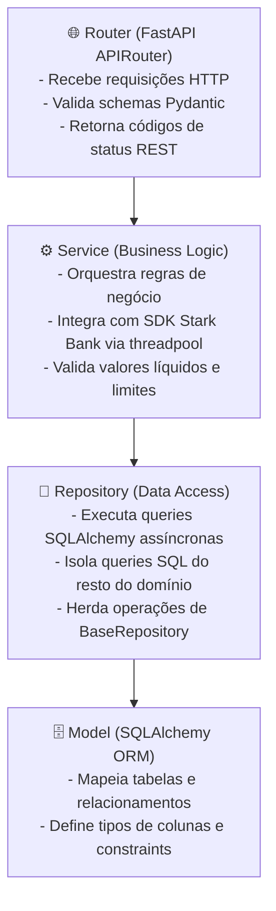
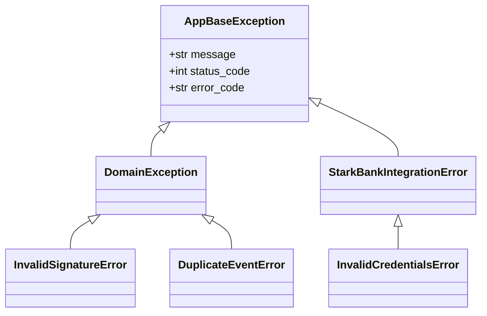

# 🏛️ Arquitetura & Design de Software

A arquitetura do projeto adota o padrão **Monólito Modular (Modular Monolith)**. Esta escolha estratégica combina a simplicidade de desenvolvimento e deploy de um monólito com a alta coesão e baixo acoplamento típicos de microsserviços.

---

## 🎯 Por que Escolhemos o Monólito Modular?

Em aplicações financeiras modernas, a divisão prematura em microsserviços traz alta complexidade operacional (latência de rede, transações distribuídas, tracing complexo, orquestração de containers). Por outro lado, um monólito tradicional desestruturado tende a se tornar um "código espaguete" de difícil manutenção.

O **Monólito Modular** resolve esse dilema separando a aplicação em **módulos de domínio independentes**, cada um com suas próprias regras, contratos, modelos e repositórios:

| Aspecto | Monólito Tradicional | Microsserviços | Monólito Modular (Nossa Escolha) |
| :--- | :--- | :--- | :--- |
| **Limites de Domínio** | ❌ Misturados / Baixa coesão | ✅ Rígidos (via rede) | ✅ **Rígidos (via pacotes isolados)** |
| **Complexidade de Deploy** | ✅ Simples (1 artefato) | ❌ Alta (dezenas de pipelines) | ✅ **Simples (1 único container de 70 MB)** |
| **Comunicação entre Módulos** | ❌ Acoplamento direto | ❌ Overhead de rede HTTP/gRPC | ✅ **Chamadas assíncronas em memória** |
| **Consistência Transacional** | ✅ Fácil (mesmo DB) | ❌ Complexa (Sagas/2PC) | ✅ **Simples (mesma sessão/transação)** |
| **Facilidade de Testes** | ⚠️ Média | ❌ Difícil (mocks de rede) | ✅ **Excelente (testes isolados e rápidos)** |

---

## 🗺️ Mapa de Módulos & Camadas

A base de código em [`app/`](file:///home/jhonatan/projects/webhook-payment/app) é organizada em módulos funcionais estritamente desacoplados:

```text
app/
├── core/                  # Configurações globais, segurança, logs e middlewares
│   ├── config.py          # Settings validadas com Pydantic v2
│   ├── concurrency.py     # Wrapper assíncrono para chamadas síncronas do SDK
│   ├── logging.py         # Formatação de logs estruturados (JSON/Console)
│   ├── middleware.py      # Request ID middleware e correlation tracking
│   ├── starkbank.py       # Inicialização do usuário Stark Bank SDK
│   └── exceptions/        # Hierarquia tipada de exceções e mapeamento HTTP
├── infra/                 # Infraestrutura de banco de dados
│   └── db/
│       └── session.py     # Engine async SQLAlchemy e session factory
├── shared/                # Classes base e contratos compartilhados
│   ├── models.py          # Base declarativa com UUID e timestamps
│   └── repository.py      # BaseRepository genérico com CRUD tipado
└── modules/               # Módulos de Domínio
    ├── invoice/           # Emissão e controle de lotes de faturas Pix
    ├── webhook/           # Recepção, validação criptográfica ECDSA e roteamento
    ├── transfer/          # Disparo e histórico de transferências de liquidação
    └── scheduler/         # Controle de ciclos periódicos e jobs APScheduler
```

---

## 🧱 Arquitetura em Camadas por Módulo

Cada módulo dentro de `app/modules/<nome>` segue rigorosamente a separação em 4 camadas bem delimitadas:



### Exemplo de Responsabilidades:
1. **`router.py`**: Apenas lida com requisições HTTP, dependências FastAPI (`Depends(get_db)`) e validação de schema.
2. **`service.py`**: Isola a inteligência do negócio (ex: cálculo de `amount - fee`, geração de dados aleatórios de cliente, chamadas assíncronas ao SDK).
3. **`repository.py`**: Encapsula queries SQL (ex: contagem de ciclos nas últimas 24h, busca por `event_id`, paginação).
4. **`model.py`**: Representa a entidade persistida no SQLite.
5. **`schema.py`**: DTOs (*Data Transfer Objects*) Pydantic para validação e serialização de JSON.

---

## 🔐 Tratamento Centralizado de Exceções

O sistema implementa uma hierarquia tipada de exceções em [`app/core/exceptions/`](file:///home/jhonatan/projects/webhook-payment/app/core/exceptions), garantindo que erros do SDK da Stark Bank ou regras de domínio violadas nunca causem *HTTP 500 Internal Server Error* genérico:



Todas as respostas de erro seguem o padrão RFC 7807 estruturado com `error`, `code`, `detail` e `request_id`.

---

## 📊 Banco de Dados & Migrações

- **Async SQLAlchemy 2.0:** Utiliza `sqlite+aiosqlite://` para operações de I/O não-bloqueantes.
- **Alembic:** Todas as alterações de tabela são rastreadas em arquivos de migração versionados no Git (`alembic/versions/`).
- **Execução Automática no Boot:** O script de inicialização do container ([`docker/entrypoint.sh`](file:///home/jhonatan/projects/webhook-payment/docker/entrypoint.sh)) roda `alembic upgrade head` antes de iniciar os servidores, garantindo que o banco de dados esteja sempre sincronizado.
