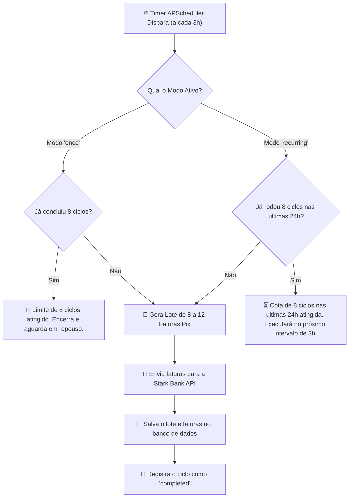
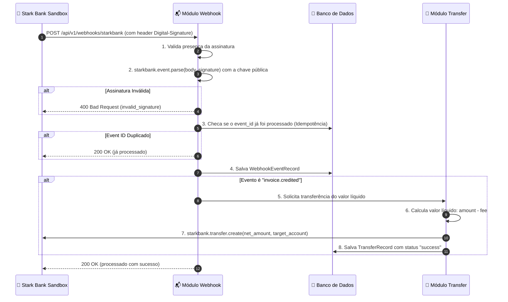

# 📋 Regras de Negócio & Motor do Agendador

Este documento explica como o sistema opera na prática: o agendador de emissões periódicas, os modos de execução, o cálculo financeiro de taxas e a validação criptográfica de Webhooks.

---

## ⏰ O Ciclo de Emissões (24 Horas / A cada 3 Horas)

A cada **3 horas** (`SCHEDULER_INTERVAL_MINUTES = 180`), o sistema dispara um ciclo automático para gerar um lote de faturas Pix no Sandbox da Stark Bank:

---

## ⚙️ Modos do Agendador: `once` vs `recurring`

O enunciado do desafio pedia para emitir faturas a cada 3 horas durante 24 horas. Para cobrir tanto o teste pontual de avaliação quanto uma operação de produção real, criamos dois modos configuráveis:

### 1. Modo `once` (Padrão para Avaliação / Sandbox)
- **Como funciona**: O sistema executa rigorosamente **8 ciclos** (8 × 3h = 24 horas) e, ao bater a meta, **encerra as emissões automáticas**.
- **Por que criamos**: Evita que a aplicação continue emitindo faturas indefinidamente no Sandbox após o término do teste.

### 2. Modo `recurring` (Produção Contínua 24/7)
- **Como funciona**: A aplicação roda continuamente sem parar. Ela emite um lote a cada 3 horas (8 lotes por dia) de forma contínua, usando uma **janela deslizante de 24 horas** para garantir que nunca sejam emitidos mais de 8 lotes em um período de 24h. Conforme o tempo avança e os ciclos anteriores completam 24h de emissão, os novos ciclos subsequentes (ciclos 9, 10, 11...) vão sendo disparados naturalmente.
- **Por que criamos**: Feito para ambientes reais onde o serviço fica rodando ininterruptamente na VPS emitindo cobranças diárias.

> **Dica**: Você pode alternar o modo em tempo de execução via `PUT /api/v1/scheduler/mode` ou disparar um ciclo imediatamente com `POST /api/v1/scheduler/trigger`.

---

## 🖐️ Disparos Agendados vs. Disparos Manuais

| Tipo de Disparo | Origem | Consome a Cota do Ciclo? | Como é Registrado? |
| :--- | :--- | :--- | :--- |
| **`scheduled`** | Timer automático do APScheduler | ✅ **Sim** (conta para a cota de 8 ciclos) | `trigger_type: "scheduled"` |
| **`manual`** | `POST /api/v1/scheduler/trigger` | ❌ **Não** (não consome cota agendada) | `trigger_type: "manual"` |
| **`batch avulso`** | `POST /api/v1/invoices/batch` | ❌ **Não** (emissão direta do módulo) | Salva direto em `invoice_batches` |

---

## 📬 Recepção do Webhook & Assinatura ECDSA

Quando uma fatura Pix é paga no Sandbox, a Stark Bank envia uma notificação HTTP `POST` para o endpoint `/api/v1/webhooks/starkbank`.

---

## 💸 Regras Financeiras da Transferência de Liquidação

1. **Filtro de Evento**: Apenas eventos onde `subscription == "invoice"` e `log.type == "credited"` acionam repasse. Outros tipos de evento (ex: `canceled`, `overdue`) são gravados para histórico e respondem `200 OK`.
2. **Cálculo em Centavos (Inteiros)**:
   $$\text{Valor da Transferência} = \text{invoice.amount} - \text{invoice.fee}$$
   *Usamos inteiros para evitar qualquer erro de arredondamento de float.*
3. **Validação de Valor Positivo**: Se por algum motivo o valor líquido for menor ou igual a zero ($\le 0$), a transferência é bloqueada e uma exceção de regra de negócio é lançada.
4. **Proteção contra Faturas Externas**: Se o webhook reportar uma fatura que não foi emitida por esta instância da aplicação, o evento é registrado para auditoria, mas nenhuma transferência é executada, evitando transferências indevidas.
