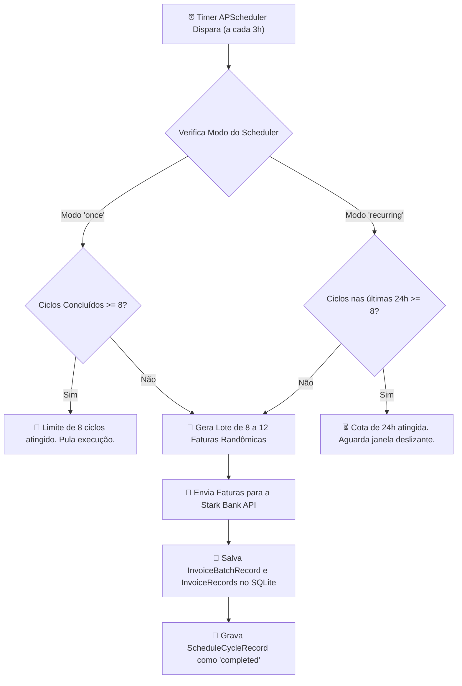
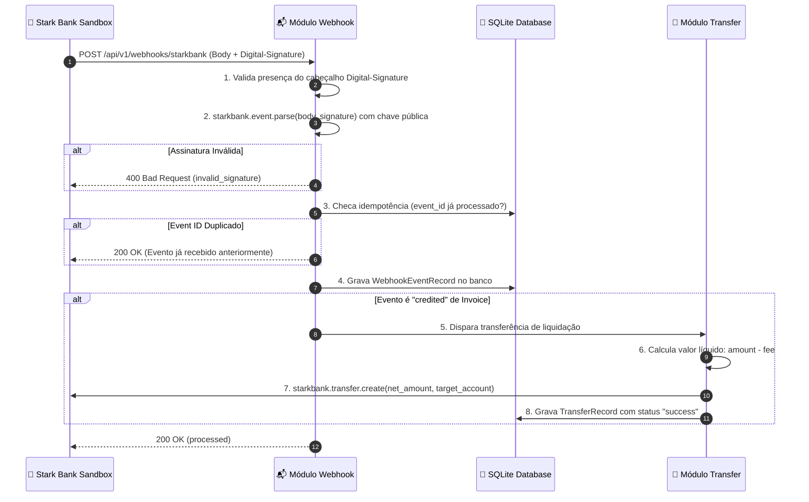

# 📋 Regras de Negócio & Motor do Agendador

Este documento detalha o fluxo de ciclo de vida das faturas, o funcionamento do agendador periódico de 24 horas, os modos de operação e o processamento de liquidação via Webhook.

---

## ⏰ O Ciclo de Emissão Periódica (24 Horas)

A cada **3 horas** (`SCHEDULER_INTERVAL_MINUTES = 180`), o sistema dispara um ciclo automatizado de emissão de faturas no ambiente Sandbox da Stark Bank:

---

## ⚙️ Modos de Operação do Agendador

O sistema suporta **dois modos dinâmicos** configuráveis via variável de ambiente (`SCHEDULER_MODE`) ou pela API em tempo de execução (`PUT /api/v1/scheduler/mode`):

### 1. Modo `once`
- **Comportamento:** Executa rigorosamente **até 8 ciclos** (totalizando 24 horas a cada 3 horas) e, após atingir a meta, **encerra as emissões automáticas** mantendo o agendador em espera.
- **Caso de uso:** Ideal para bater a meta exata de testes de 24h sem gerar cobranças indefinidas no Sandbox.

### 2. Modo `recurring` (Produção Contínua)
- **Comportamento:** Opera continuamente em produção. Utiliza uma **janela deslizante de 24 horas** para garantir que nunca sejam emitidos mais de 8 lotes dentro de qualquer intervalo de 24 horas (`get_completed_cycle_count_in_24h`).
- **Caso de uso:** Ambientes de produção onde a operação precisa rodar ininterruptamente respeitando o teto diário.

---

## 🖐️ Disparos Manuais vs. Agendados

O sistema faz distinção explícita entre ciclos automáticos e execuções manuais sob demanda:

| Tipo | Origem | Consome Cota de Ciclos? | Registro |
| :--- | :--- | :--- | :--- |
| **`scheduled`** | Timer do APScheduler (a cada 3h) | ✅ **Sim** (incrementa contador de 24h) | `trigger_type: "scheduled"` |
| **`manual`** | `POST /api/v1/scheduler/trigger` | ❌ **Não** (não consome cota agendada) | `trigger_type: "manual"` |
| **`batch avulso`** | `POST /api/v1/invoices/batch` | ❌ **Não** (emissão direta do módulo) | Apenas em `invoice_batches` |

---

## 📬 Recepção de Webhook & Verificação Criptográfica ECDSA

Quando uma fatura Pix é paga no Sandbox do Stark Bank, a plataforma envia um Webhook HTTP `POST` para o endpoint `/api/v1/webhooks/starkbank`.

---

## 💸 Regra de Transferência de Valor Líquido

A regra de transferência obedece às seguintes premissas financeiras:

1. **Filtro de Evento:** Apenas eventos onde `subscription == "invoice"` e `log.type == "credited"` disparam transferências. Eventos de outros tipos (como `created`, `canceled` ou `overdue`) são registrados no banco com status `ignored` e respondem `200 OK`.
2. **Cálculo do Valor Líquido:**
   $$\text{Valor da Transferência} = \text{invoice.amount} - \text{invoice.fee}$$
3. **Proteção contra Valor Não-Positivo:** Se o valor líquido for $\le 0$, a transferência não é enviada e um log de aviso é registrado.
4. **Conta de Destino:** O valor líquido é transferido para os dados bancários institucionais configurados nas variáveis de ambiente (`TARGET_TAX_ID`, `TARGET_BANK_CODE`, `TARGET_BRANCH_CODE`, `TARGET_ACCOUNT_NUMBER`, `TARGET_ACCOUNT_TYPE`).
