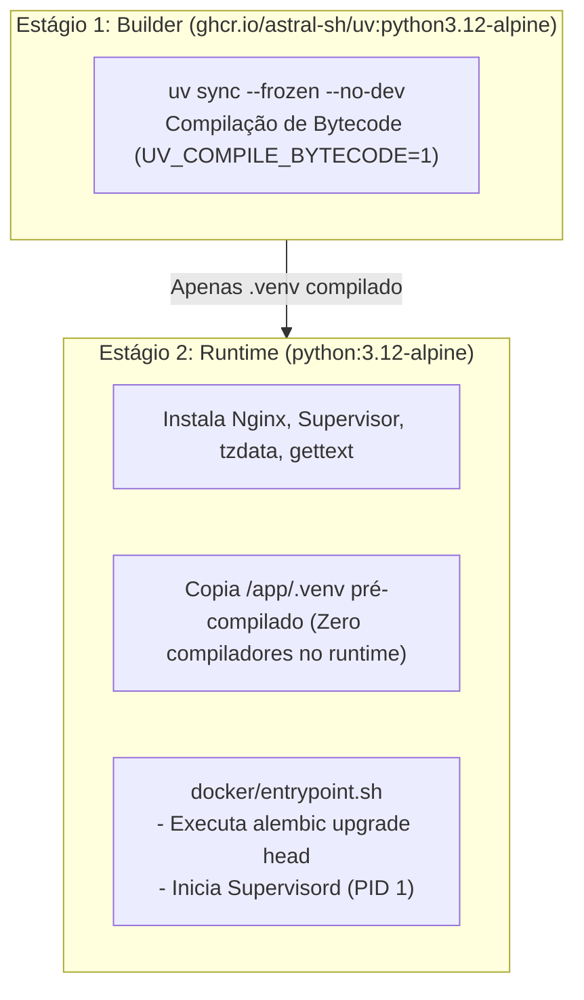
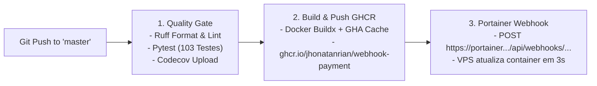

# 🚢 Deploy, Infraestrutura & CI/CD

A infraestrutura e o processo de deploy contínuo foram desenhados para aliar **máxima leveza**, **segurança**, **zero-downtime** e **automação total**.

---

## 🏗️ Arquitetura do Container Docker

A imagem Docker é baseada em um **Multi-Stage Build** de dois estágios:



### Destaques da Imagem:
- **Tamanho Total Comprimido:** Apenas **~70.5 MB**.
- **Segurança Máxima:** Não contém compiladores (`gcc`, `musl-dev`) no runtime final.
- **Performance:** Bytecode Python pré-compilado acelera o tempo de inicialização (*cold start*).
- **Socket Unix de Alta Velocidade:** Nginx comunica diretamente com o Uvicorn via socket Unix local (`unix:/tmp/app.sock`), eliminando overhead de rede TCP interna.

---

## 🤖 Pipeline de CI/CD (GitHub Actions)

A pipeline em [`.github/workflows/deploy.yml`](file:///home/jhonatan/projects/webhook-payment/.github/workflows/deploy.yml) é acionada a cada commit ou merge na branch `master`:



---

## 🌐 Deploy em VPS com Portainer & Traefik v3

A aplicação roda em uma VPS própria integrada com o **Portainer** e o proxy reverso **Traefik v3**:

```yaml
version: "3.8"

services:
  app:
    image: ghcr.io/jhonatanrian/webhook-payment:latest
    restart: always
    environment:
      - ENVIRONMENT=sandbox
      - DATABASE_URL=sqlite+aiosqlite:////data/webhook_payment.db
      - STARK_PROJECT_ID=${STARK_PROJECT_ID}
      - STARK_PRIVATE_KEY=${STARK_PRIVATE_KEY}
      - SCHEDULER_MODE=once
      - SCHEDULER_INTERVAL_MINUTES=180
    volumes:
      - payment_data:/data
    networks:
      - public
    deploy:
      replicas: 1
      labels:
        - "traefik.enable=true"
        - "traefik.docker.network=public"
        - "traefik.http.routers.payment.rule=Host(`${DOMAIN:-payment.jrmdev.com.br}`)"
        - "traefik.http.routers.payment.entrypoints=websecure"
        - "traefik.http.routers.payment.tls.certresolver=myresolver"
        - "traefik.http.services.payment.loadbalancer.server.port=8080"

volumes:
  payment_data:
    name: webhook_payment_data

networks:
  public:
    external: true
```

### Vantagens Desta Configuração:
1. **IP Fixo Estático Garantido:** A VPS possui um IP público fixo cadastrado com perfil de Admin no Stark Bank, permitindo emissões e transferências sem bloqueios de IP.
2. **Persistência do SQLite:** O volume Docker nomeado (`webhook_payment_data`) persiste os dados no disco da VPS independentemente de reinicializações ou updates de versão.
3. **SSL Automático com Let's Encrypt:** O Traefik emite e renova os certificados HTTPS automaticamente sem intervenção manual.
4. **Deploy sem Downtime:** O webhook do Portainer recria o container preservando o volume de dados em poucos segundos.
