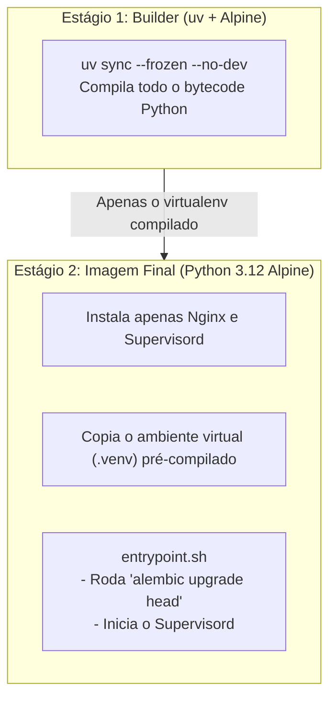
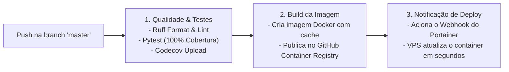

# 🚢 Deploy, Infraestrutura & CI/CD

Aqui explicamos como empacotamos e colocamos a aplicação para rodar em produção com foco em leveza (~70 MB), segurança e automação.

---

## 🏗️ Como a Imagem Docker é Construída

Usamos um **Multi-Stage Build** com Alpine Linux e Astral `uv` para gerar uma imagem ultra-compacta:



### Principais Vantagens:
- **Tamanho Reduzido**: A imagem final compactada fica em apenas **~70 MB**.
- **Segurança**: Ferramentas de compilação (`gcc`, `musl-dev`) são descartadas no primeiro estágio, mantendo o container de execução limpo.
- **Nginx via Unix Socket**: O Nginx conversa com o Uvicorn através de um socket Unix local (`/tmp/app.sock`), o que é muito mais rápido do que fazer requisições TCP internas em `localhost:8000`.

---

## 🤖 Pipeline de CI/CD (GitHub Actions)

Toda vez que um commit entra na branch `master`, a esteira do GitHub Actions executa os seguintes passos:



---

## 🌐 Rodando em VPS com Portainer & Traefik v3

Abaixo está o exemplo de `docker-compose.yml` utilizado para subir a aplicação em uma VPS com Traefik cuidando do HTTPS automático:

```yaml
version: "3.8"

services:
  app:
    image: ghcr.io/jhonatanrian/webhook-payment:latest
    restart: always
    environment:
      - ENVIRONMENT=sandbox
      - DATABASE_URL=sqlite+aiosqlite:////data/webhook_payment.db
      - STARK_PROJECT_ID=${STARK_PROJECT_ID}
      - STARK_PRIVATE_KEY=${STARK_PRIVATE_KEY}
      - SCHEDULER_MODE=once
      - SCHEDULER_INTERVAL_MINUTES=180
    volumes:
      - payment_data:/data
    networks:
      - public
    deploy:
      replicas: 1
      labels:
        - "traefik.enable=true"
        - "traefik.docker.network=public"
        - "traefik.http.routers.payment.rule=Host(`${DOMAIN:-payment.jrmdev.com.br}`)"
        - "traefik.http.routers.payment.entrypoints=websecure"
        - "traefik.http.routers.payment.tls.certresolver=myresolver"
        - "traefik.http.services.payment.loadbalancer.server.port=8080"

volumes:
  payment_data:
    name: webhook_payment_data

networks:
  public:
    external: true
```

### Detalhes Práticos:
1. **Persistência de Dados**: O banco SQLite fica salvo no volume nomeado `/data`, garantindo que os dados não sejam perdidos quando o container é recriado.
2. **SSL Automático**: O Traefik emite e renova os certificados Let's Encrypt automaticamente.
3. **IP Fixo**: A VPS possui um IP público fixo, ideal para cadastrar no painel do Stark Bank.

---

## 📊 Telemetria & Consumo Real em Produção

Abaixo estão as métricas reais coletadas do container rodando continuamente na VPS através do Portainer:


- **Uso de Memória**: Apenas **~3.5 MB de RAM**, demonstrando a eficiência do runtime Alpine + Uvicorn.
- **Uso de CPU**: Praticamente **0.0% a 0.2%**, com picos desprezíveis durante a emissão de faturas e processamento de webhooks.
- **I/O e Rede**: Leituras e escritas assíncronas no SQLite sem gargalos de disco.
