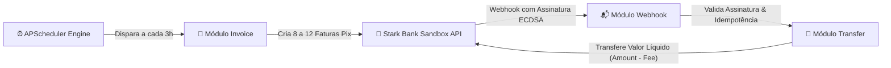

# ⚡ Webhook Payment Integration with Stark Bank

Bem-vindo à documentação técnica do projeto! Aqui você encontra todos os detalhes sobre a arquitetura, regras de negócio, testes e deploy da integração com o Stark Bank.

---

## 🎯 O que é este projeto?

Este sistema automatiza o ciclo completo de cobrança e repasse financeiro integrado ao ambiente Sandbox do **Stark Bank**:

1. **Emissão Automatizada**: A cada 3 horas, emite um lote de 8 a 12 faturas Pix aleatórias ao longo de um ciclo de 24 horas.
2. **Recepção de Webhooks**: Escuta eventos de faturas pagas/creditadas (`invoice.credited`), validando a assinatura criptográfica **ECDSA** enviada pelo Stark Bank.
3. **Repasse Automático**: Ao confirmar o crédito, calcula o valor líquido (`amount - fee`) e dispara uma transferência automática Pix para a conta destino da instituição.
4. **Idempotência & Concorrência**: Protege contra entregas duplicadas de webhooks e garante que chamadas síncronas do SDK não travem o Event Loop do FastAPI.

---

## 🛠️ Tecnologias Utilizadas

- **Python 3.12** com tipagem estática moderna (`PEP 695`).
- **FastAPI 0.110+** para a API HTTP assíncrona e documentação OpenAPI/Swagger.
- **Astral `uv`** para gerenciamento de dependências e ambientes determinísticos.
- **SQLite + SQLAlchemy 2.0 (Async)** com `aiosqlite` para persistência assíncrona.
- **Alembic** para versionamento e aplicação automática de migrações de banco.
- **APScheduler** para orquestração de ciclos de agendamento em background.
- **Ruff & Pytest** para garantia de qualidade, linting e 100% de cobertura de testes.
- **Docker Alpine + Nginx + Traefik** para container leve (~70 MB) com proxy via Unix socket.

---

## 🧭 Guia de Navegação

A documentação está dividida nos seguintes arquivos:

- 🏛️ **[Arquitetura & Design de Software](architecture.md)**: Como estruturamos o Monólito Modular, a divisão em 4 camadas e as estratégias de concorrência com threads e locks.
- 📋 **[Regras de Negócio & Ciclos](business-rules.md)**: Como funcionam os modos `once` vs `recurring`, os cálculos financeiros de taxas e a validação ECDSA.
- 📌 **[Catálogo de Endpoints](api-reference.md)**: Todas as rotas da API com exemplos reais de payload de entrada e saída.
- 🚢 **[Deploy, Infraestrutura & CI/CD](deployment.md)**: Detalhes do Dockerfile multi-stage, proxy Nginx via socket Unix, Portainer e Traefik v3.
- 🧪 **[Estratégia de Testes](testing.md)**: Organização dos testes unitários, testes de concorrência massiva e relatórios de cobertura.
- 🛠️ **[Ferramental & Configurações](tooling.md)**: Dicas de uso do Astral `uv`, comandos do Ruff e ativação do Git pre-push hook.
